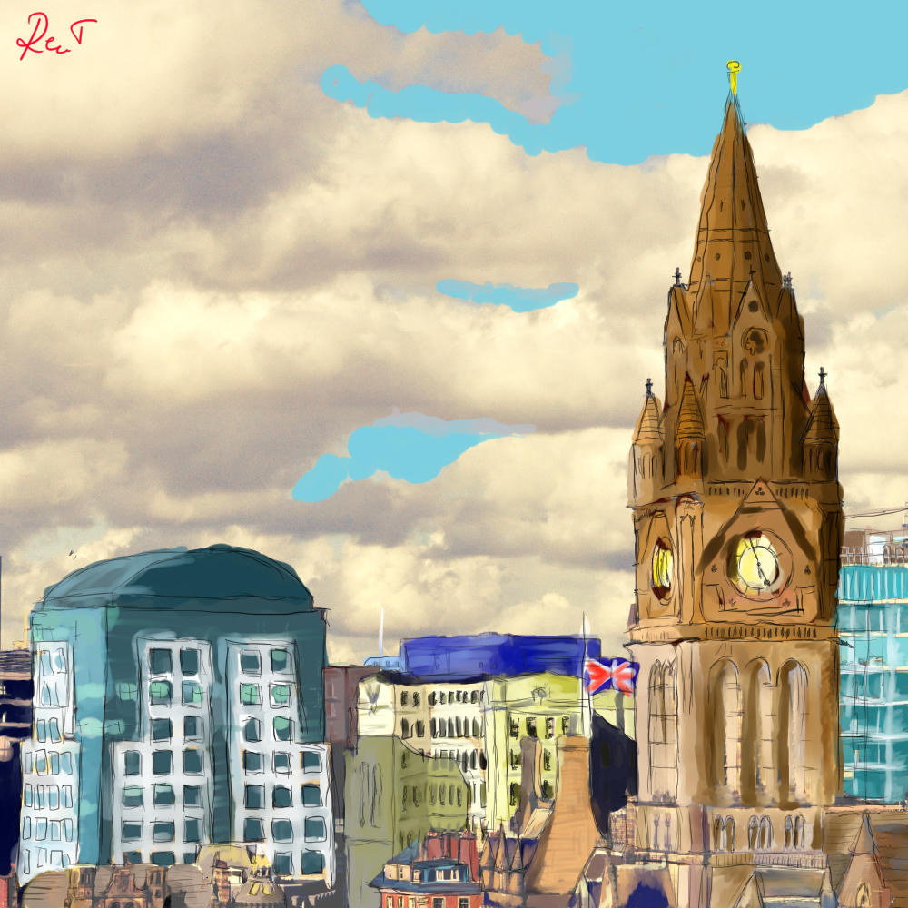
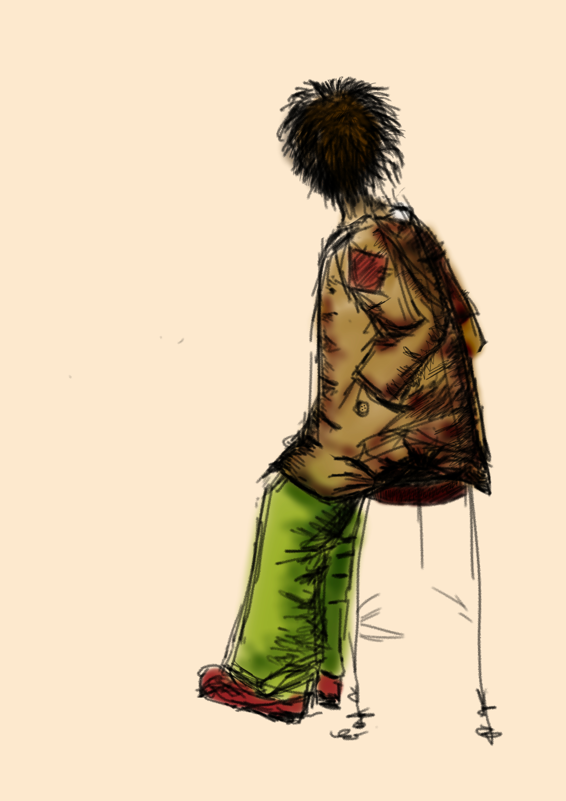

## About
I am studying Computer Science and Mathematics at the University of Manchester. I am passionate about Pure Maths because I love mathematical reasoning and making links between different mathematical fields, such as Number Theory, Group Theory, Graph Theory, Linear Algebra, Analysis, Topology, and so on.

Mathematical research papers:

[Shuffling Cards](ExplorationLab-ShufflingCards.pdf)

[Euler's identity](Euler_s_Identity (8).pdf)

In college, I got involved in many Computer Science related activities. I built with some of my class mates a robot who was able to move, read colors and preset images, raise and throw cubes upwards. I interfaced Raspberry Pi with electronic components like sensors and PIRs. Solved problems with algorithms in either C++ or Python. I developed a 2D platformer with my own costumisation for the pricipal character.

I also have a Visual Portofolio which I'm pround of:
  
 
 
